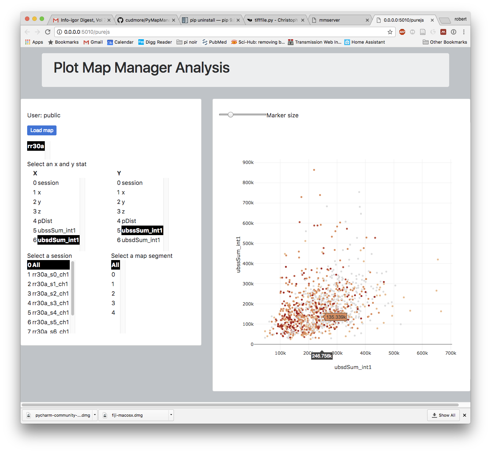

PyMapManager is an ecosystem of tools to load and visualize time-series annotations and 3D image volumes.

The workflow is to use the Igor Pro version of <A HREF="http://blog.cudmore.io/mapmanager/">Map Manager</A> and then use PyMapManager to easily perform additional visualization and analysis.

Please see the main [PyMapManager](http://blog.cudmore.io/PyMapManager) documentation website.

## Repository contents

 - [pymapmanager/](pymapmanager/) : Python package to load and visualize time-series annotations and images.
 - [examples/](examples/) : Jupyter notebooks with example Python code using pymapmanager.
 - [mmserver/](mmserver/) : A Python Flask server that provides a REST interface to easily retrieve Map Manager annotations and images.
 - [mmclient/](mmclient/) : A user friendly front-end Javascript client to plot annotations and view image time-series from a `mmserver` REST server.
 - [pymapmanager/mmio/](pymapmanager/mmio) : Helper class allowing pymapmanager Python code to load annotations and images from a `[mmserver/](mmserver/)` REST server.
 
## PyMapManager Python package

Python package to open and analyze Map Manager files. Please see the <A HREF="http://pymapmanager.readthedocs.io/en/latest/">API Documentation</A> and a backup copy <A HREF="http://robertcudmore.org/mapmanager/PyMapManager/docs/">here</A>. See the <A HREF="https://github.com/cudmore/PyMapManager/tree/master/PyMapManager/examples">PyMapManager/examples/</A> folder for iPython notebooks with code examples.

## Map Manager server

A server to browse and share Map Manager annotates and time-series images via the web. The server uses the PyMapManager Python package as an back-end.

This screenshot shows web based browsing and plotting of Map Manager annotations.



These screenshots show web based browsing of 3D image volume time-series with spine annotations overlaid.


## PyQt interface

The next generation desktop application version of Map Manager. Written in Python using the Qt interface library and using the PyMapManager Python package as an back-end.

This project will be merged with <A HREF="https://github.com/cmicek1/TiffViewer">PyQt TiffViewer</A> created by <A HREF="https://github.com/cmicek1">Chris Micek</A>.

The PyQt GUI interface is in <A HREF="https://github.com/cudmore/PyMapManager/tree/master/PyMapManager/interface">/PyMapManager/interface</A>


This screen shot shows the main PyQt interface window (left), a map plot (top center), a stack plot (top right), and a stack image plot (bottom right).


## Install Python PyMapManager package

### Install required Python libraries

```
pip install numpy
pip install pandas
pip install requests
pip install tifffile
```

### Install PyMapManager Package
  
```
pip install PyMapManager
```

Once installed, PyMapManager is available in python as `import pymapmanager`. See the [examples/](examples/) to get started.


## Run the Map Manager server

The server is made of two components, a back-end REST server and a client-side Javascript server.

 1. The back-end server is in `mmserver/mmserver.py` and provides a REST interface using Python Flask.
 2. The client-side Javascript server is in `mmclient/` and provides a front end point-and-click interface in a web browser.

### Run the back-end REST server

Install libraries

```
pip install rest
pip install rest-cors
pip install scikit-image
```

Run

```
cd mmserver
python mmserver.py
```

Once running, the REST interface can be accessed via

```
http://localhost:5010
```

### Run the client-side Javascript server

Make sure `mmclient/static/mmserver.js` points to your localhost REST interface

Edit `mmclient/static/mmserver.js` and make sure `serverurl` points to your localhost `mmserver`.

```
serverurl = 'http://127.0.0.1:5010/'
```

Install http-server

Download and manually install [node](https://nodejs.org/en/download/).

```
npm install http-server -g
```

Run

```
cd mmclient
http-server
```

Once running, the client-side server can be accessed via

```
http://localhost:8080
```
	
   
## Run the PyQt interface

We have downgraded development of the PyQt interface to focus on the web client/server version of Map Manager

### Downgrade anaconda from PyQt5 to PyQt4
 
```
conda uninstall pyqt
conda install pyqt=4	
```

### Run the qt interface

```
cd PyMapManager/interface
python main.py
```
	  
 
