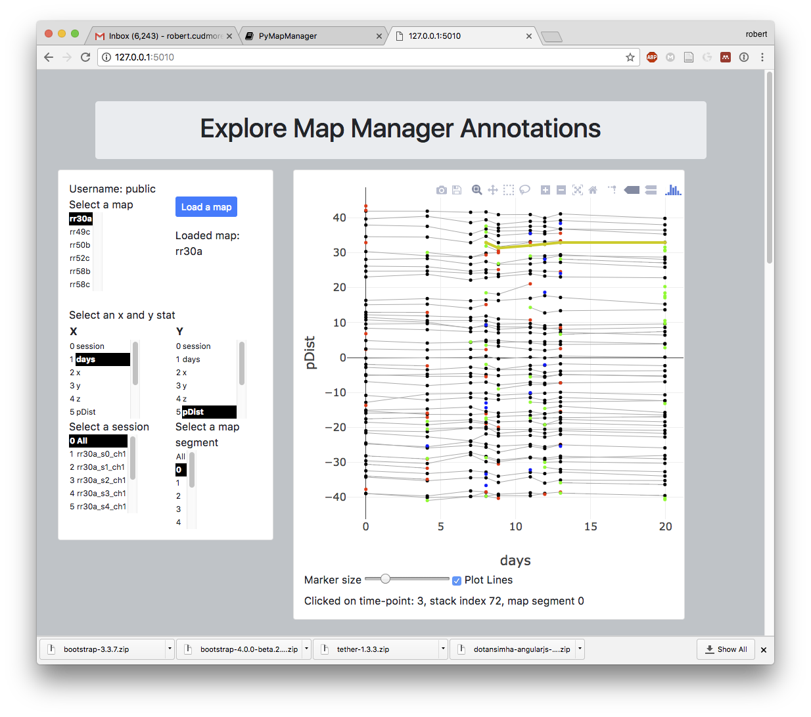

PyMapManager is python package to load and visualize MapManager files. The workflow is to use the Igor Pro version of <A HREF="http://blog.cudmore.io/mapmanager/">Map Manager</A> to create annotated maps and stacks. Then, use the PyMapManager Python package to easily perform additional analysis.

## PyMapManager Python package

Python package to open and analyze Map Manager files.

Please see the <A HREF="http://pymapmanager.readthedocs.io/en/latest/">API Documentation</A> and a backup copy at <A HREF="http://robertcudmore.org/mapmanager/PyMapManager/docs/">here</A>.

See the <A HREF="https://github.com/cudmore/PyMapManager/tree/master/PyMapManager/examples">PyMapManager/examples/</A> folder for iPython notebooks with code examples.

## Map Manager server

A server to browse and share Map Manager files via the web. The server uses the PyMapManager Python package as an back-end.

This screenshot shows web based browsing and plotting of Map Manager annotations.

This screenshot shows web based browsing of a stack with spine annotations overlaid.

## PyQt interface

The next generation desktop application version of Map Manager. Written in Python using the Qt interface library and using the PyMapManager Python package as an back-end.

This project will be merged with <A HREF="https://github.com/cmicek1/TiffViewer">PyQt TiffViewer</A> created by <A HREF="https://github.com/cmicek1">Chris Micek</A>.

The PyQt GUI interface is in <A HREF="https://github.com/cudmore/PyMapManager/tree/master/PyMapManager/interface">/PyMapManager/interface</A>

This screen shot shows the main PyQt interface window (left), a map plot (top center), a stack plot (top right), and a stack image plot (bottom right).

## Install Python PyMapManager package

Once installed, PyMapManager is available in python as `import pymapmanager`

 - Install [anaconda][1]
 - Install [tifffile][2]. This version is for Python 2.7, newer versions are for Python 3.x
 
    conda install -c conda-forge tifffile=0.12.1

 - Install PyMapManager
  
    # cd into folder that contains `PyMapMAnager` folder
    pip install -e PyMapManager

## Run the `mmserver` server

Once the serve is running, it is available at `http://0.0.0.0:5010/`

	cd mmserver
	python mmserver.py
	
   
## Install PyQt desktop application

 - For pyqt interface, Downgrade anaconda from PyQt5 to PyQt4
 
	conda uninstall pyqt
	conda install pyqt=4	
	  
## To do

 1. [done] Generate API documentation from doc strings
 2. [done] Load individual slices dynamically (how to query number of slices in .tif file?)
 3. [done] Use the mmserver REST API to make a standalone web-app using Flask, Angular, and Plotly
 4. Implement visualization of a spine run in mmserver.
 5. Make mmserver link all plot, clicking in one will highlight in other.
 6. mmserver needs to use `map pool` so publication data can easily be presented.
 
[1]: https://www.continuum.io/downloads
[2]: http://www.lfd.uci.edu/~gohlke/
